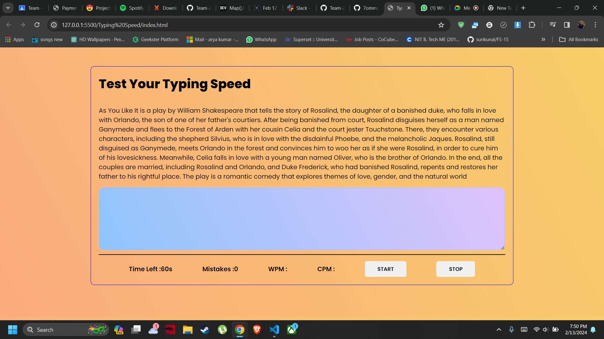

# Typing Speed Test Game

Welcome to the Typing Speed Test Game project! This project is a fun and interactive way to improve your typing speed and accuracy. Built with HTML, CSS, and JavaScript, it calculates real-time typing speed, mistakes, words per minute (WPM), and characters per minute (CPM).

## Overview

The Typing Speed Test Game provides users with a platform to test and improve their typing skills. With a clean and intuitive user interface, users can easily start the test, type the given text accurately, and receive instant feedback on their performance.

## Features

- *Real-time Typing Speed*: Calculates typing speed in real-time as the user types.
- *Mistake Tracking*: Tracks mistakes made by the user during the typing test.
- *Words Per Minute (WPM)*: Calculates the number of words typed per minute based on the user's performance.
- *Characters Per Minute (CPM)*: Calculates the number of characters typed per minute.
- *Interactive Interface*: Provides a user-friendly interface for an engaging typing experience.
- *Customizable Texts*: Allows users to choose from a selection of texts for the typing test.

## Usage

1. Clone the repository to your local machine:

    bash
    git clone https://github.com/7ommyShelby/Team20.git
    

2. Open the project directory:

    bash
    cd typing-speed-test
    

3. Open the index.html file in your preferred web browser.

4. Start the typing test by clicking the "Start" button and begin typing the displayed text accurately.

5. After completing the test, view your typing speed, mistakes, words per minute (WPM), and characters per minute (CPM) displayed on the screen.

## Contributing

Contributions to this project are welcome! If you'd like to contribute, please follow these steps:

1. Fork the repository.
2. Create a new branch (git checkout -b feature/new-feature).
3. Make your changes.
4. Commit your changes (git commit -am 'Add new feature').
5. Push to the branch (git push origin feature/new-feature).
6. Create a new Pull Request.

## Credits

This project was created and maintained by [Arya Kumar](https://github.com/7ommyShelby).

## Screenshot

